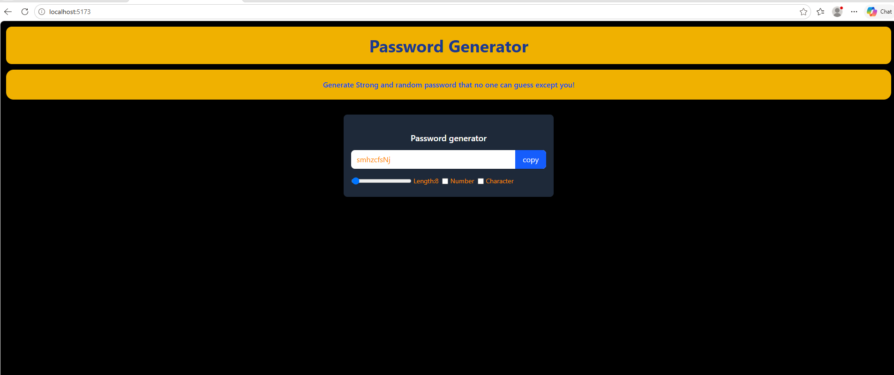

# 🔐 Password Generator

A simple password generator built with **React** that generates random passwords based on the selected options.

## 🚀 Features

* Generate random passwords
* Adjust password length
* Include numbers
* Include characters
* Copy the generated password to the clipboard

## 🛠️ Tech Stack

* React

## 📸 Preview



## ⚙️ Getting Started

### 1. Clone the repository

```bash
git clone https://github.com/AayanThakur/password-generator.git
```

### 2. Navigate to the project

```bash
cd password-generator
```

### 3. Install dependencies

```bash
npm install
```

### 4. Start the development server

```bash
npm run dev
```

## 📚 What I Learned

While building this project, I practiced:

* React `useState`
* Event handling
* Managing state
* Working with input values
* Generating random passwords
* Conditional logic
* Updating the UI based on state
* Copying text to the clipboard

## 👨‍💻 About This Project

This project was built as part of my journey learning React and practicing React fundamentals through a small, functional application.

